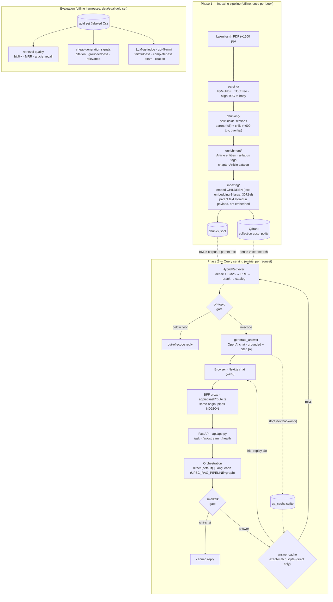
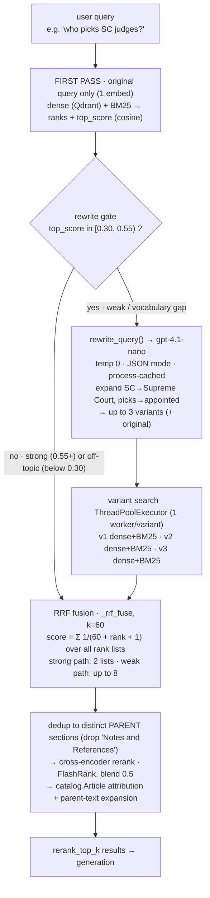

# Architecture

Editable (Mermaid) architecture diagrams for **Structured-RAG**. These render on GitHub and
in most Markdown viewers. `docs/architecture.svg` is a static end-to-end render of the same
system; this file is the source-of-truth, diff-able version and adds the detailed retrieval
view.

- [1. System overview](#1-system-overview) — indexing, serving, and evaluation
- [2. Multi-query retrieval](#2-multi-query-retrieval-gated-rewrite--rrf-fusion) — the gated rewrite + RRF fusion

---

## 1. System overview

Two-phase system: build the index **offline** (once per book), serve queries **online** (per
request). A separate set of **offline eval harnesses** scores retrieval and generation on a
labeled gold set.

**Load-bearing ideas**

- **Structure preserved end-to-end** — every chunk carries `PART ▸ Chapter ▸ Section ▸ pages ▸ Articles`, so retrieval is filterable and answers are citable.
- **Parent–child retrieval** — embed small children for *precision*, return the parent section for *context*.
- **Hybrid + rerank** — dense and BM25 fused by RRF, then a cross-encoder blended in to separate lookalike sibling sections.
- **One core, three surfaces** — CLI, API, and UI all call the same `HybridRetriever` + `generate_answer`.
- **Config-driven** — a new book = new YAML under `config/books/`, same code path.
- **Two orchestration backends** — direct calls or a LangGraph state machine, same steps, identical eval numbers.

---

## 2. Multi-query retrieval (gated rewrite + RRF fusion)

The retriever can expand a question into **up to 3 rewrite variants** (synonyms/abbreviations)
and fuse retrieval over all of them — but only when the original query retrieves *weakly*.
Well-phrased queries skip the rewrite entirely, so the cost is paid only where it helps.

**Why it's built this way**

- **"3 variants" = `retrieval.rewrite.num_variants`.** The original query is always kept, so
  fusion runs over **up to 4 queries → up to 8 rank lists** (each query yields a dense list and
  a BM25 list).
- **The gate is the point** (`retrieval/hybrid.py`). Rewriting costs an LLM call + 3× embeds +
  3× searches, so it fires only when the first pass is weak *but still on-topic*:
  `relevance_floor (0.30) ≤ top_score < score_threshold (0.55)`.
  - **Strong** (≥ 0.55) → single-query path, ~0.2–1 s.
  - **Off-topic** (< 0.30) → skip (the relevance gate will reject it downstream anyway).
  - **Only weak/colloquial** queries pay the full multi-query cost (~2 s).
- **Fan-out is concurrent** — each variant needs its own embedding round-trip, so `_search_one`
  runs across a `ThreadPoolExecutor` (measured ~1.24 s → ~0.33 s for the embed/search portion).
- **Rewrite model** is `gpt-4.1-nano` (config `retrieval.rewrite.model`), temperature 0,
  JSON-mode, **process-cached** per `(query, model, num_variants)`.
- **RRF generalizes to N lists** — one formula handles the 2-list strong path and the 8-list
  weak path identically; no special-casing.

> **Note:** on the current 30-question gold set almost every question clears the 0.55 gate, so
> the rewrite layer rarely fires in eval — its lift shows up on genuinely messy/abbreviation-heavy
> queries. The plumbing is correct and gated; demonstrating its value needs a more colloquial
> gold set (the gold-set-expansion item).

---

## Config knobs (see `config/default.yaml`)

| Block | Key knobs |
|-------|-----------|
| `retrieval` | `top_k`, `rerank_top_k`, `relevance_floor` |
| `retrieval.rewrite` | `enabled`, `num_variants`, `model`, `score_threshold` |
| `retrieval.rerank` | `enabled`, `model`, `candidate_pool`, `weight` (cross-encoder blend) |
| `retrieval.catalog` | `enabled`, `match` (embedding\|chapter), `score_threshold`, `max_articles` |
| `retrieval.graph` | `enabled` (shelved — sparse entities on this corpus) |
